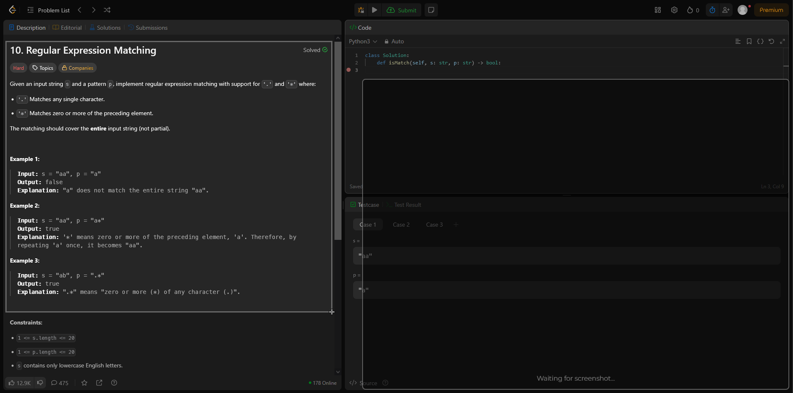
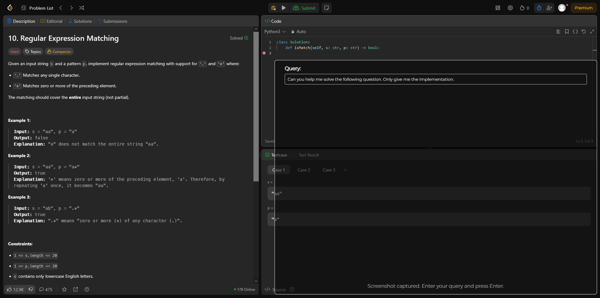
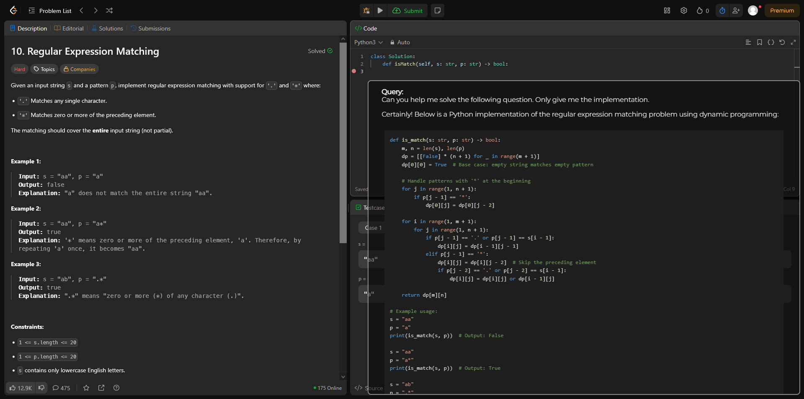
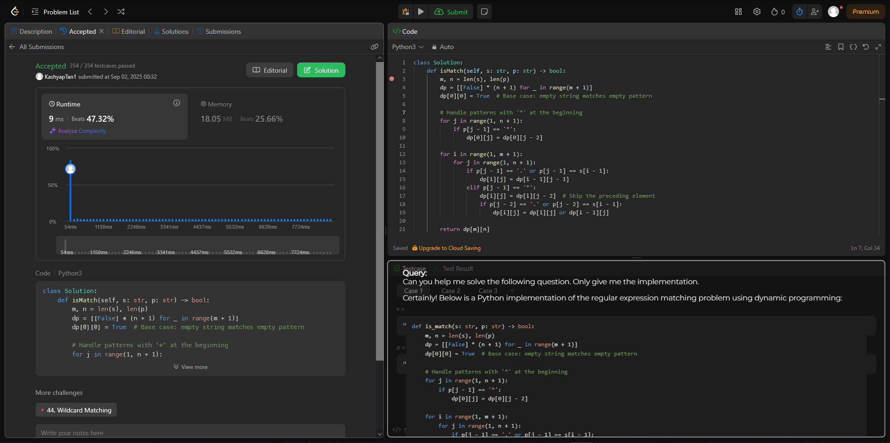

  

<h3 align="center">Answers for anything on your screen with Clueless.</h3>
<h4 align="center">| Free | Easy | Fast | Private |<h4>

---

# Clueless | Official Ollama Community Integration 🎉
Take a screen shot of anything on your screen and start talking with or about it in real-time.
# Getting Started 
## Prerequisites
- **Ollama**: You need to install Ollama and run a model
  - Download from [ollama.com](https://ollama.ai/)
  - Pull a vision model: `ollama run qwen2.5vl:7b` (this is the default model)
  - Currently, the only model you can use with Clueless is `qwen2.5vl:7b`
    - I am working on creating compatibality with all vision models

## Installation

### Quick Download

  

**Alternative:** Download from the [Releases](https://github.com/KashyapTan/clueless/releases) page

#### Windows Security Notice
You may see a Windows Defender SmartScreen warning:
- This appears because the app is not yet code-signed with a commercial certificate
- The app is safe to install - click "More info" then "Run anyway"
- I am working on obtaining a code signing certificate to eliminate this warning

# Usage
1. Launch Clueless
2. Take a screenshot with `ctrl + shift + alt + s`
3. Enter a prompt or just click enter in textbox
4. Response generated in real-time

# Demo(s)
## Video Demo

  

### 🎥 Watch Full Demo on YouTube

  

## 1. Launch Clueless and take a screenshot

  

## 2. Enter a prompt

  

## 3. Response generated in real-time

  

## 4. Results

  

# Upcoming features
- ~~User Desktop Application In Progress~~
- ~~Make window  & screenshot undetectable to screen share~~
- Chat without image
- Chat with message history
- Model selector on UI (currently need to manual change model in `source/main.py` and rebuild the dist)
- Web search MCP integration
- macOS compatability
